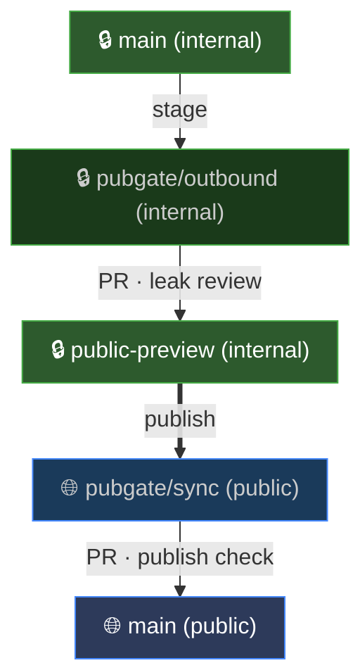
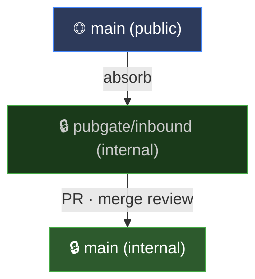

# pubgate

[](https://github.com/ardiloot/pubgate/actions/workflows/pre-commit.yml)
[](https://github.com/ardiloot/pubgate/actions/workflows/pytest.yml)

Safe bidirectional sync between internal and public git repos.

## The Problem

You have an internal repo with proprietary code and you want to open-source parts of it. This creates two ongoing problems:

1. **Leak risk.** Internal files, code sections, and commit history must never reach the public repo. Standard git tools (fork, merge, cherry-pick) all carry or expose internal commits, and a single misstep exposes everything. `git filter-repo` can strip history once, but rewrites SHAs on every run, breaking external clones and making it unusable for continuous sync.

2. **Silent divergence.** Once two repos exist, they drift apart. Public contributions arrive on one side, internal development continues on the other, and without a disciplined process the repos become increasingly hard to reconcile: patches stop applying, filtered content falls out of sync, and nobody notices until it's a project to fix.

## What It Does

pubgate prepares branches for review. You create and merge PRs on your git host (GitHub, GitLab, etc.). It handles both directions:

- Stage outbound changes behind an internal leak-review PR gate
- Push reviewed content to a PR branch on the public repo
- Absorb public contributions back into internal main with three-way merge

Filtering is mechanical: built-in ignore patterns exclude common internal/private/secret file naming conventions out of the box, `BEGIN-INTERNAL` / `END-INTERNAL` markers strip sections from individual files, and `pubgate.toml` is always excluded automatically. Custom `ignore` patterns in the config replace the defaults.

**Core principle:** the public repo is always an exact filtered copy of internal, never an independent fork. If external contributions arrive mid-cycle, `publish` bases the public PR on the last absorbed commit; git's three-way merge preserves them or surfaces conflicts. Divergence stays controlled and bounded.

The two workflows:

<table>
<tr>
<td valign="top" width="50%"><strong>Making changes public: absorb → stage → publish</strong><br><em>absorb is recommended first if the public repo has unabsorbed changes, but stage and publish proceed either way</em>



</td>
<td valign="top" width="50%"><strong>Incorporating public contributions: absorb</strong><br><em>Run when the public repo has external contributions</em>



</td>
</tr>
</table>

## Getting Started

### Prerequisites

- Python 3.10+ and `git` CLI
- An existing internal repo with an `origin` remote
- An existing public repo (can be empty)
- A clean worktree on `main`, synced with `origin` (no uncommitted changes, no unpushed commits)

### Setup

1. Install:
   ```bash
   pip install pubgate
   ```
2. Create `pubgate.toml` in repo root:
   ```toml
   public_url = "git@github.com:you/public-repo.git"
   ```
   Built-in ignore patterns cover common conventions (`.internal/*`, `*-internal.*`, `*.internal.*`, `*.secret`, etc.). To override them, set `ignore` explicitly (see [Configuration](#configuration)).
3. Optionally, mark internal-only sections in files (in addition to ignore patterns, you can hide parts of individual files). Three comment styles are supported:
   ```python
   # BEGIN-INTERNAL
   secret_stuff()
   # END-INTERNAL
   ```
   ```javascript
   // BEGIN-INTERNAL
   secretStuff();
   // END-INTERNAL
   ```
   ```html
   <!-- BEGIN-INTERNAL -->
   <div class="secret">...</div>
   <!-- END-INTERNAL -->
   ```
   Markers must be properly paired. Nested, unclosed, or orphan `END-INTERNAL` markers cause an error. After scrubbing, a residual check catches any surviving markers that were not removed.
4. Initialize tracking:
   ```bash
   pubgate absorb
   ```
   On first run, this records the current public repo HEAD as the starting point for future syncs. It creates a PR branch that records this baseline in a tracking file (`.pubgate-state-inbound`). Create a PR from that branch into `main` on your git host and merge it.

## Workflow

### Making changes public: absorb → stage → publish

pubgate prepares branches for review but does not create PRs. You create and merge them on your git host. After merging changes into internal `main` through your normal PR process:

1. Recommended: run `pubgate absorb` if the public repo has unabsorbed changes, then merge the inbound PR. This isn't required (`stage` and `publish` proceed either way) but it keeps the public snapshot clean.
2. Run `pubgate stage`. This creates a `pubgate/outbound` branch with the filtered snapshot for leak review.
3. Create a PR from `pubgate/outbound` → `public-preview` on your git host. This is the leak-review gate. Review it to ensure no internal code is exposed. Merge when satisfied.
4. Run `pubgate publish`. This delivers the reviewed content to the public repo as a `pubgate/sync` branch.
5. Create a PR from `pubgate/sync` → `main` on the public repo. Merge after CI passes.

### Incorporating public contributions: absorb

Run when the public repo has external contributions that need to be brought into the internal repo.

1. Run `pubgate absorb`. This creates a `pubgate/inbound` branch with the merged public changes for review.
2. Create a PR from `pubgate/inbound` → `main` on your git host.
3. Resolve conflicts if any.
4. Merge the PR.

## Branches and State Tracking

**Branches**

Making changes public (absorb → stage → publish):
- **`main`** (internal): internal development branch (protected)
- **`pubgate/outbound`** (internal): branch for leak review: filtered internal content → `public-preview`
- **`public-preview`** (internal): holds reviewed outbound content; created automatically on first `stage` if it doesn't exist
- **`pubgate/sync`** (public): branch for publish review: reviewed content → public `main`
- **`main`** (public): public-facing branch (protected)

Incorporating public contributions (absorb):
- **`pubgate/inbound`** (internal): branch for merge review: public changes → internal `main`

**State files**

- `.pubgate-state-inbound` (on `main`): tracks which public commit was last absorbed
- `.pubgate-state-outbound` (on `public-preview`): tracks which internal commit was last staged

Created and updated automatically.

## CLI Reference

| Command | What it does |
|---------|-------------|
| `pubgate stage` | Build a filtered snapshot of internal code and create a branch for leak review |
| `pubgate publish` | Push reviewed content to a PR branch on the public repo |
| `pubgate absorb` | Merge public contributions into an internal branch for review |

Flags `--dry-run` and `--force` come after the command. `--repo-dir` comes before it.

| Flag | Position | Description |
|------|----------|-------------|
| `--dry-run` | after command | Show planned actions without writing branches or files. Still syncs with remotes to ensure accurate plans. Example: `pubgate stage --dry-run` |
| `--force` | after command | Overwrite an existing PR branch from a previous run whose PR was not yet merged. Without this flag, pubgate errors out if the PR branch already exists. Force-push is blocked on protected branches (`main`, `public-preview`, and public `main`). Example: `pubgate absorb --force` |
| `--repo-dir` | before command | Run pubgate against a specific repo path instead of the current directory. Example: `pubgate --repo-dir /path/to/repo stage` |

## Configuration

Full `pubgate.toml` example (all fields shown with defaults, only `public_url` is required for first-time setup when the remote doesn't already exist):

```toml
# Internal repo
internal_main_branch = "main"
internal_preview_branch = "public-preview"

# Public repo (public_url is required if the git remote isn't already configured)
public_url = "git@github.com:you/public-repo.git"
public_remote = "public-remote"
public_main_branch = "main"
public_pr_branch = "pubgate/sync"

# Sync branches (internal repo)
inbound_pr_branch = "pubgate/inbound"
outbound_pr_branch = "pubgate/outbound"

# State tracking
inbound_state_file = ".pubgate-state-inbound"
outbound_state_file = ".pubgate-state-outbound"

# Filtering (fnmatch syntax; patterns match against both full path and basename)
# These override the built-in defaults. Omit to use the defaults:
#   .internal/*  internal/*  *-internal.*  *.internal.*  *_internal.*
#   *-private.*  *.private.*  *_private.*  *.secret  *.secrets
ignore = [
    ".internal/*",
    "*-internal.*",
    "*.internal.*",
    "*.secret",
]
```

## Edge Cases

- **Binary files**: included as-is in outbound snapshots (`BEGIN-INTERNAL` markers inside binaries are not processed); during absorb, binary modifications take the public version and are flagged for manual review.
- **Renames on public repo**: the new path is copied in; the old file is kept locally and flagged for review.
- **Deletions on public repo**: deleted files are kept locally and flagged for review in the absorb PR.
- **Merge conflicts**: absorb uses three-way merge. Conflicts produce standard git conflict markers (`<<<<<<<`/`=======`/`>>>>>>>`) for manual resolution.
- **Sync artifacts**: absorb excludes both state files (`.pubgate-state-inbound`, `.pubgate-state-outbound`) from the diff (they are sync artifacts, not external contributions). When only state files changed since the last absorb, the resulting PR only updates `.pubgate-state-inbound` (tracking-only).
- **Empty files after scrubbing**: files that become empty after removing `BEGIN-INTERNAL` blocks are still included in the outbound snapshot.
- **External contribution between stage and publish**: if someone pushes to the public repo after you stage but before you publish, `publish` still proceeds: it bases the public PR on the last absorbed commit, and git's three-way merge preserves external contributions or surfaces conflicts in the public PR. For a clean snapshot, run `absorb` → merge inbound PR → `stage` → merge outbound PR → `publish`.
- **Stale branch cleanup**: after you merge a PR and its source branch is auto-deleted on the server, pubgate automatically prunes the stale local branch on the next run. No manual cleanup needed.
- **Commit messages**: absorb commit messages list the public commits being absorbed (safe, they are already public). Stage commit messages list the internal commits since the last stage (safe, stays on the internal repo; useful context for the leak reviewer).
- **Repeated publish without absorb**: if you publish multiple times without running `absorb` between cycles, each publish PR is based on the same absorbed commit. This produces a trivially resolvable merge conflict on `.pubgate-state-outbound` in the public PR (take the newer value). Running `absorb` between cycles avoids this.
- **Do not edit the pubgate PR branch directly**: the `pubgate/sync` branch must only contain content produced by `publish`. Manual edits to this branch before merging will be silently overwritten by the next publish cycle (they are not detected as external contributions). If published content needs a fix, make the change in the internal repo and re-run `stage` → `publish`.

## Troubleshooting

| Error | Cause | Fix |
|-------|-------|-----|
| "working tree is not clean" | Dirty worktree | Commit or stash your changes |
| "expected branch 'main', currently on '...'" | Not on the main branch | Run `git checkout main` |
| "HEAD is detached" | Detached HEAD state | Run `git checkout main` |
| "unpushed commit(s)" | Local `main` is ahead of origin | Push your commits or reset |
| "behind" | Local `main` is behind origin | Run `git pull --rebase` |
| "diverged" | Local `main` has diverged from origin | Reconcile manually (rebase or reset) |
| "branch '...' already exists" | Previous PR not merged | Merge the PR, or use `--force` to overwrite |
| "no inbound state found" | First run, or absorb not yet done | Run `pubgate absorb` to create initial baseline |
| "no outbound state found" | Stage PR not merged | Run `pubgate stage` and merge the internal PR |

## Example: Full First-Time Walkthrough

```bash
# 1. Clone your internal repo and cd into it
git clone git@internal-host:you/internal-repo.git
cd internal-repo

# 2. Create pubgate.toml (built-in ignore patterns cover common conventions)
cat > pubgate.toml << 'EOF'
public_url = "git@github.com:you/public-repo.git"
EOF
git add pubgate.toml && git commit -m "Add pubgate config" && git push

# 3. Bootstrap - records the public repo's current HEAD as baseline
pubgate absorb
# Output: pushes pubgate/inbound branch
# → Go to your git host, create PR: pubgate/inbound → main, merge it

# 4. Stage outbound content (filters out internal files and scrubs markers)
pubgate stage
# Output: pushes pubgate/outbound branch
# → Create PR: pubgate/outbound → public-preview, review for leaks, merge it

# 5. Publish to public repo
pubgate publish
# Output: pushes pubgate/sync to the public remote
# → Create PR: pubgate/sync → main on the public repo, merge it

# Done! For future syncs: absorb (if needed) → stage → publish.
```

## Development

Requires Python 3.10+ and [uv](https://docs.astral.sh/uv/).

For design decisions and detailed command specifications, see [SPEC.md](SPEC.md).

```bash
uv sync                         # install dependencies
uv run pre-commit install       # set up pre-commit hooks (ruff, ty, etc.)
uv run pytest                   # run tests (-n auto for parallel)
uv run pre-commit run -a        # run all linting & formatting checks
```

Tests create temporary git repos locally. No network access needed.

## License

MIT. See [LICENSE](LICENSE).
